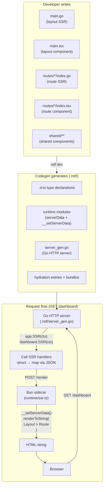

# Architecture

```mermaid
flowchart TB
    subgraph Developer["Developer writes"]
        main_go["main.go\n(layout SSR)"]
        main_tsx["main.tsx\n(layout component)"]
        route_go["routes/*/index.go\n(route SSR)"]
        route_tsx["routes/*/index.tsx\n(route component)"]
        shared["shared/**\n(shared components)"]
    end

    subgraph Codegen["Codegen generates (.rstf/)"]
        types[".d.ts type declarations"]
        generated["runtime modules\n(serverData + __setServerData)"]
        server["server_gen.go\n(Go HTTP server)"]
        entries["hydration entries + bundles"]
    end

    subgraph Request["Request flow (GET /dashboard)"]
        browser["Browser"] -->|GET /dashboard| go_server["Go HTTP server\n(.rstf/server_gen.go)"]
        go_server -->|"app.SSR(ctx)\ndashboard.SSR(ctx)"| ssr_calls["Call SSR handlers\nstruct → map via JSON"]
        ssr_calls -->|"POST /render"| sidecar["Bun sidecar\n(runtime/ssr.ts)"]
        sidecar -->|"__setServerData()\nrenderToString(\n  Layout > Route\n)"| html["HTML string"]
        html --> browser
    end

    Developer -->|"rstf dev"| Codegen
    Codegen --> go_server
```
